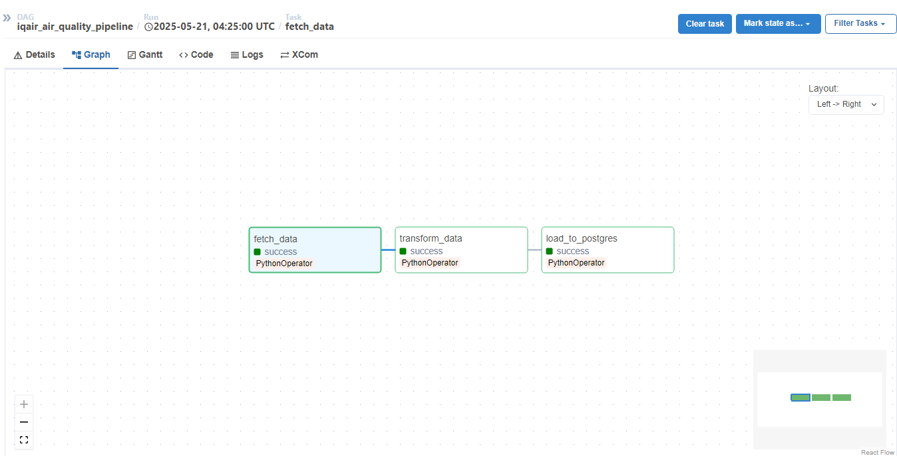
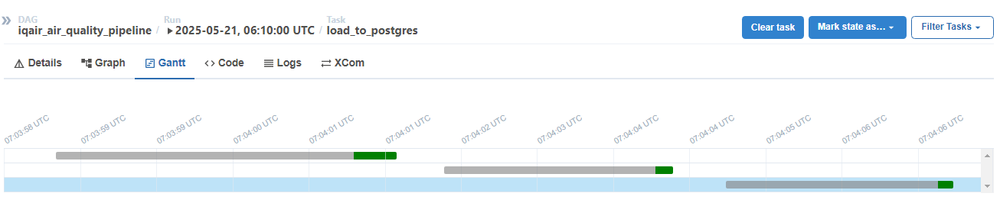
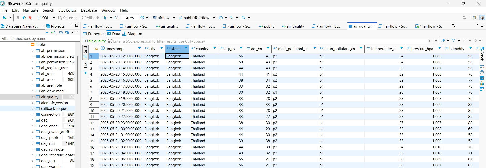
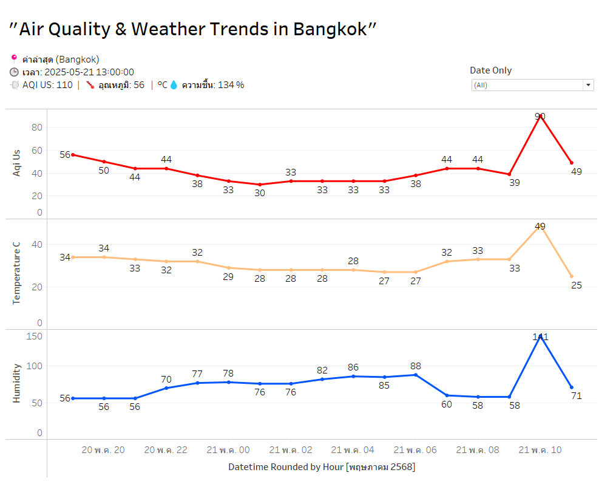

# 🌤️ Air Quality Data Pipeline with Apache Airflow

This project implements a complete end-to-end data pipeline that collects air quality data from the [IQAir API](https://www.iqair.com/), stores it in a PostgreSQL database, and visualizes it with Tableau. The pipeline is orchestrated using Apache Airflow, containerized with Docker Compose, and automated via GitHub Actions with a self-hosted runner.

---

## 🚀 Project Overview

- ⏱️ **Scheduler**: Apache Airflow orchestrates the ETL process hourly (configurable)
- ☁️ **Data Source**: IQAir API providing real-time air quality metrics in **Bangkok, Thailand**, including:
  - AQI (US & China standards), temperature, humidity, wind speed & direction, pressure
- 🗃️ **Data Sink**: PostgreSQL database for structured data storage
- 🔁 **Automation**: CI/CD using GitHub Actions + self-hosted runner to auto-deploy DAGs
- 📊 **Visualization**: Data available for BI tools like Tableau or Looker Studio

---

## 🧰 Tech Stack

| Tool               | Purpose                                      |
|--------------------|----------------------------------------------|
| Python             | API extraction and data processing           |
| Apache Airflow     | Workflow orchestration and DAG scheduling    |
| PostgreSQL         | Relational database to store time-series data|
| Docker Compose     | Local orchestration of containers            |
| GitHub Actions     | CI/CD pipeline for automatic DAG deployment  |
| Tableau            | BI dashboard for visualizing air quality     |

---

## 🔐 API Key Setup

To use this project, you must have an API key from [IQAir](https://www.iqair.com/air-pollution-data-api).

1. Create a file named `.env` in the root folder.
2. Add the following line to `.env`:

```
API_KEY=your_actual_api_key_here
```

> ⚠️ Do **not** share your `.env` file or commit it to GitHub.  
> Use the provided `.env.example` as a reference only.

---

## 🗃️ Database Schema

```sql
CREATE TABLE air_quality (
    timestamp TIMESTAMP,
    city TEXT,
    state TEXT,
    country TEXT,
    aqi_us INTEGER,
    aqi_cn INTEGER,
    main_pollutant_us TEXT,
    main_pollutant_cn TEXT,
    temperature_c INTEGER,
    pressure_hpa INTEGER,
    humidity INTEGER,
    wind_speed REAL,
    wind_direction INTEGER,
    weather_icon TEXT
);
```

---

## 📂 Project Structure

```
air-quality-airflow/
├── dags/
│   └── iqair_air_quality_dag.py
├── docker-compose.yml
├── .env.example
├── .gitignore
├── .github/
│   └── workflows/
│       └── deploy.yml
├── README.md
```

---

## 🔁 CI/CD Pipeline

- Trigger: `push` to `main` branch under `dags/`
- Runner: GitHub Actions with self-hosted runner on local machine
- Tasks:
  1. Checkout latest code
  2. Copy DAGs to Airflow webserver container
  3. Restart scheduler to reload updated DAGs

```bash
docker cp dags/. airflow-webserver:/opt/airflow/dags/
docker restart airflow-scheduler
```

> This ensures zero manual deployment steps – every DAG update is automatically applied.

---

## 📸 Sample Output

### Airflow DAG Structure

This DAG fetches data from IQAir, transforms it, and stores it into PostgreSQL:

- Airflow display 
DAG graph



And Gantt view



- PostgreSQL : Example rows inserted from DAG run



---

## 🚀 Getting Started Locally

```bash
# Start all containers
docker-compose up -d

# Airflow Web UI
http://localhost:8080
# Login: airflow / airflow
```

---

## 📊 Visualization Preview (Tableau)



---

## 📌 Notes

- IQAir API used in the free tier (limited by request volume)
- Airflow version: 2.8.1
- PostgreSQL version: 13
- Schedule interval: configurable (currently set to every hour at minute 10 - `'10 * * * *'`)

---

## 🧑‍💻 Author

**Photsawat Buanuam**  
📫 [LinkedIn](https://www.linkedin.com/in/photsawat-buanuam-85a7952a3/)  
📁 GitHub: [Photsawat-hub](https://github.com/Photsawat-hub)

---

## 🏷️ Tags

`#Airflow` `#DataPipeline` `#CI/CD` `#GitHubActions`  
`#PostgreSQL` `#Python` `#Docker` `#IQAirAPI` `#Tableau`